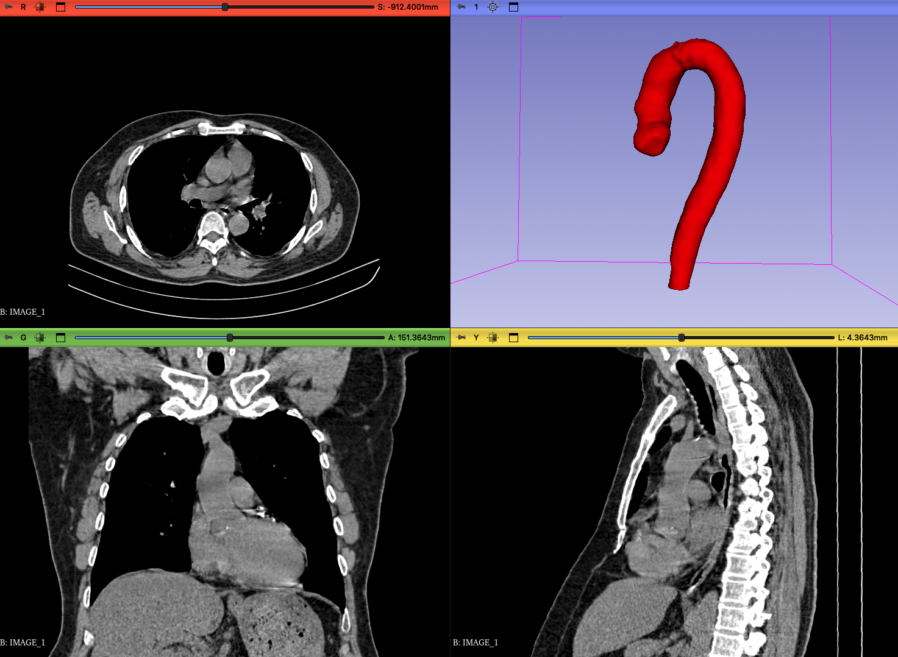
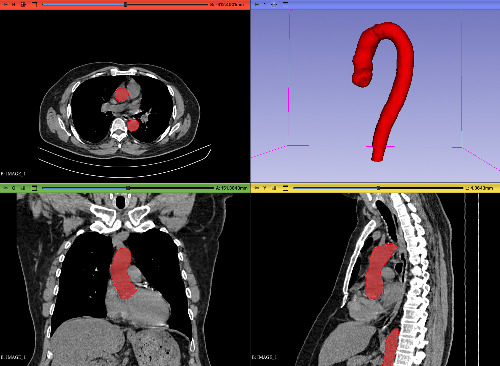
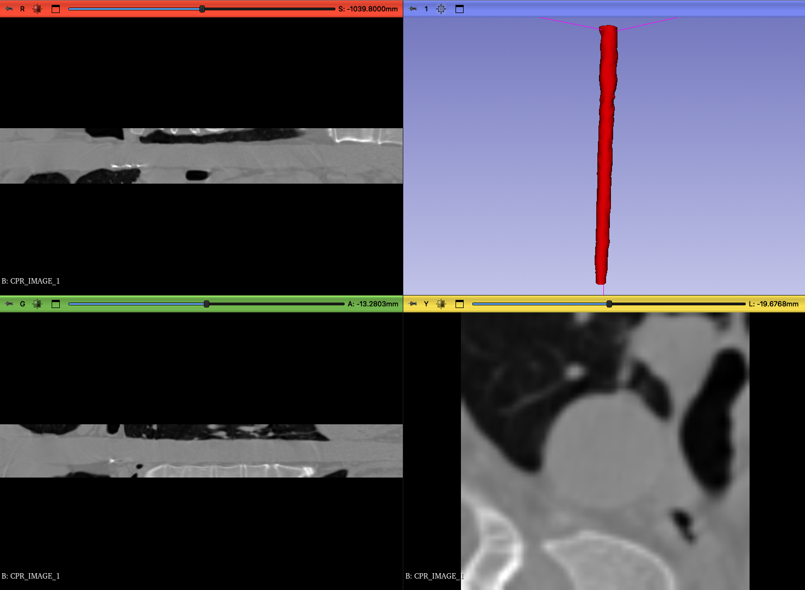
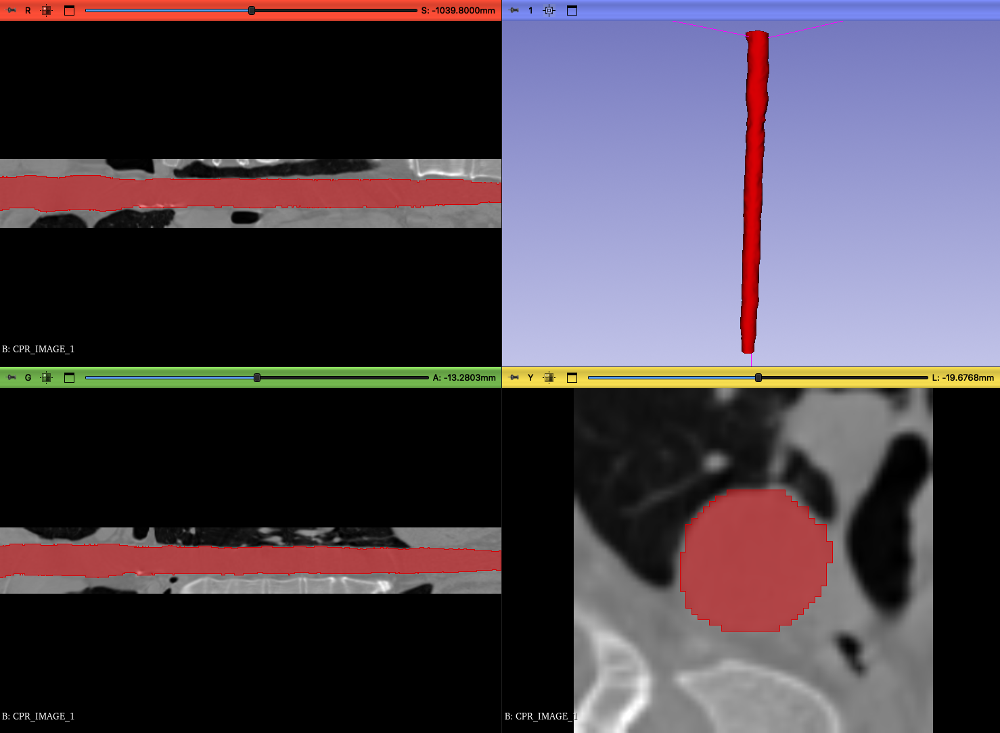

# Curved Planar Reformat (CPR)

A Python tool for straightening curved vessels from CT/MRI scans into a flat, easy-to-read format. Perfect for analyzing coronary arteries, aortas, and other tubular structures without the need for complex 3D navigation.

## What is CPR?

Imagine a curved blood vessel like a winding road. CPR "unwraps" this curved 3D structure into a straightened 2D image - like taking that winding road and laying it flat on a map. This makes it much easier to:

- Measure vessel lengths accurately
- Spot blockages or narrowing (stenosis)
- Visualize the entire vessel in one view
- Compare different parts of the vessel side-by-side

## How It Works

The tool does two main things:

### 1. Extract Centerline (`extract`)
Takes a vessel segmentation mask and finds the center path through it
- Converts the 3D vessel mask into a skeleton (1-pixel-wide centerline)
- Orders the points from start to end
- Downsamples to reduce computation (adjustable with `--skip`)

### 2. Generate CPR (`cpr`)
Takes the CT image and centerline points, then creates the straightened view
- Uses cubic spline interpolation for smooth resampling
- Creates perpendicular slices along the vessel path
- Stacks them into a straightened 3D volume
- Field of view (FOV) controls how much surrounding tissue to include

## Screenshots

### Before: Normal View
The vessel appears curved and requires scrolling through many slices to see it all.




### After: CPR View
The entire vessel is straightened and visible in one view, making measurements and diagnosis easier.




## Video Demo

Watch the CPR process in action:

<video src="docs/axial_cpr_view.mov" width="640" controls></video>

*Note: If the video doesn't play, download it from the `docs/` folder*

## Installation

```bash
# Clone the repository
cd Project

# Create a virtual environment (recommended)
python -m venv venv
source venv/bin/activate  # On macOS/Linux
# OR
venv\Scripts\activate  # On Windows

# Install required packages
pip install -r requirements.txt
```

## Usage

### Step 1: Extract Centerline Coordinates

First, extract the vessel centerline from your segmentation mask.

```bash
python main.py extract -s <SEGMENTATION_FILE> -o <OUTPUT_POINTS.npy>
```

**Parameters:**
- `-s` / `--seg`: Path to vessel segmentation file (NIfTI format)
- `-o` / `--output`: Where to save the centerline points (default: points.npy)
- `-k` / `--skip`: Skip factor for downsampling (default: 10)
  - Higher values = faster but less detailed
  - Lower values = slower but smoother

**Example:**
```bash
python main.py extract \
    -s ./data/vessel_segmentation.nii.gz \
    -o ./points.npy \
    -k 10
```

### Step 2: Generate CPR Image

Use the extracted points and original CT image to create the straightened view.

```bash
python main.py cpr -i <IMAGE_FILE> -p <POINTS.npy> -o <OUTPUT.nii.gz> -f <FOV_MM>
```

**Parameters:**
- `-i` / `--input`: Path to CT image file (NIfTI format)
- `-p` / `--points`: Path to centerline points from Step 1
- `-o` / `--output`: Where to save CPR image (default: reformatted_image.nii.gz)
- `-f` / `--fov`: Field of view in millimeters
  - Controls how much surrounding tissue to include
  - Example: 50mm shows 25mm on each side of the vessel

**Example:**
```bash
python main.py cpr \
    -i ./data/ct_scan.nii.gz \
    -p ./points.npy \
    -o ./cpr_output.nii.gz \
    -f 60
```

### Complete Workflow Example

```bash
# Step 1: Extract centerline from segmentation
python main.py extract \
    -s "/path/to/vessel_segmentation.nii.gz" \
    -o "vessel_centerline.npy" \
    -k 5

# Step 2: Generate CPR from CT scan
python main.py cpr \
    -i "/path/to/ct_image.nii.gz" \
    -p "vessel_centerline.npy" \
    -o "straightened_vessel.nii.gz" \
    -f 50

# Done! Open straightened_vessel.nii.gz in your medical viewer
```

## File Structure

```
Project/
├── main.py          # Command-line interface
├── cpr.py           # Core CPR functions
├── README.md        # This file
├── docs/            # Documentation images/videos
└── Example/         # Example data
    ├── Original/    # Input CT images
    ├── CPR/         # Output CPR images
    └── data_points.npy  # Example centerline points
```

## Contributing

Found a bug or want to add a feature? Feel free to:
- Open an issue
- Submit a pull request
- Suggest improvements

## License

MIT License - Feel free to use this in your projects

---

**Note**: This tool is for research purposes. Always validate results with clinical experts before making medical decisions.

